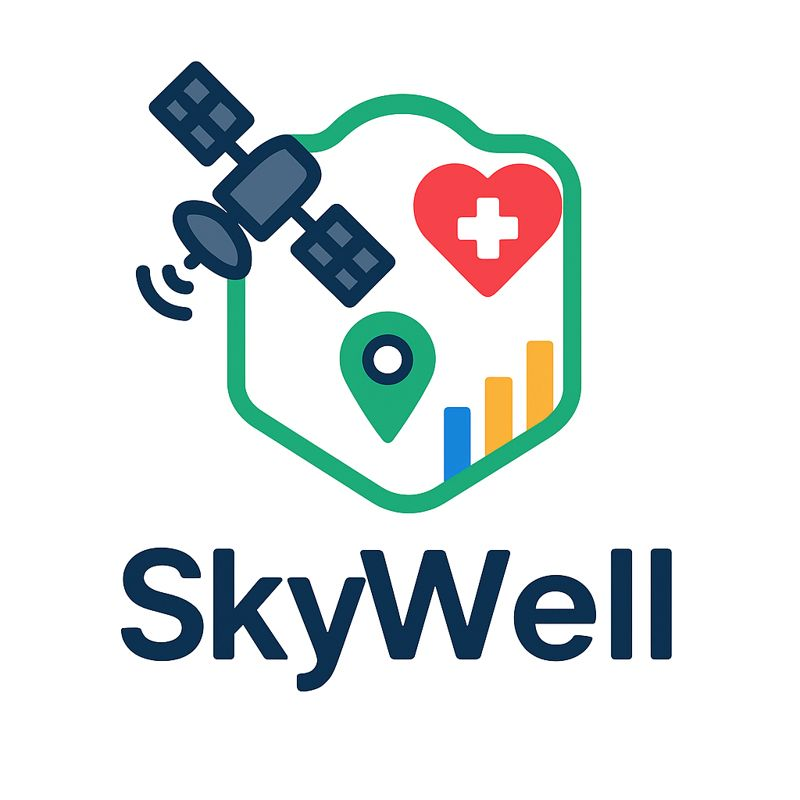

# SkyWell

---

## ❗ Problem Statement

Patients often lack clear, actionable insights tailored to their medical conditions. This leads to poor decision-making in daily routines, causing:
- Increased **follow-up costs** — health deterioration, wasted time, and avoidable expenses.
- Frustration from using **multiple apps** to gather fragmented weather, health, and alert information.
- Annoyance due to **irrelevant notifications** and **generic forecasts** that don’t reflect their personal needs.

---

## 🔍 Overview

Our system provides **personalized weather alerts** based on satellite data and a user’s specific health profile. Whether you have pollen allergies, asthma, or heart issues, our platform helps you **act smarter** by adapting your routine to your condition and environment — **proactively**.

---

## 🔧 How It Works

1. **Data Collection**  
   Satellite and environmental data are continuously collected (e.g., temperature, pollen, humidity).

2. **Data Processing**  
   Raw data is structured and cleaned through preprocessing pipelines.

3. **User Input**  
   Users input relevant health information like chronic illnesses or sensitivities.

4. **AI Modeling**  
   Our AI model cross-references weather data with individual conditions to assess risk.

5. **Forecast Display**  
   A general weather forecast is displayed in-app for transparency.

6. **Personalized Alerts**  
   If the AI detects a threat based on the user’s profile, a **personalized alert** is sent.

---

## 🧠 Architecture Diagram

> Our end-to-end pipeline from satellite data ingestion to user alert generation.

---

## ✨ Features

- 🌍 Real-time satellite-based data
- 🤒 Personalized condition-aware forecasting
- 🔔 Smart, non-intrusive mobile alerts
- 📱 Unified user interface (no app-hopping)
- 🔐 Privacy-first data handling (GDPR-compliant)

---

## 💻 Tech Stack

| Layer            | Technology                         |
|------------------|------------------------------------|
| Data Ingestion   | Python, APIs (e.g., OpenWeather)   |
| AI/ML            | Scikit-learn / TensorFlow / PyTorch|
| Backend          | Flask / FastAPI                    |
| Frontend         | React Native / Flutter             |
| Database         | PostgreSQL / Firebase              |
| Notification     | Firebase Cloud Messaging / Twilio  |
| Deployment       | Docker, GitHub Actions, Vercel     |

---

## 🚀 Getting Started

### Prerequisites

- Python 3.8+
- Node.js (for frontend)
- PostgreSQL or Firebase account
- API keys for weather and geolocation data

## 🔍 Competitors & Our Edge
  | Competitor               | Shortcomings                               | How We're Better                                       |
| ------------------------ | ------------------------------------------ | ------------------------------------------------------ |
| Generic Weather Apps     | One-size-fits-all notifications            | Personalized, condition-aware alerts                   |
| Health Tracking Apps     | Lack real-time environmental integration   | Syncs live weather with user health conditions         |
| Pollen/Allergy Apps      | Narrow focus, no general weather insights  | Holistic — includes weather, air quality, pollen, etc. |
| Government Alert Systems | Delayed, region-only and impersonal alerts | Instant, hyper-personalized warnings via mobile        |

